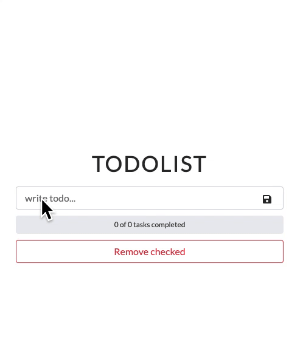

# To-do List App

To-do app with add, delete, edit, drag functionality. Data persist in local storage and the progress bar shows how many tasks are completed. The app is published in chrome extensions web store.

[Chrome extensions](https://chrome.google.com/webstore/detail/todo-list-app/jmglbofkoehdcbaigahpimmbkfdlepdj?hl=en&authuser=0)

[Live demo](https://todo-charli.netlify.app/)

## Lessons Learned

- react-beautiful-dnd
- boostrap
- chrome extensions manifest json

## Demo



## Run Locally

Install

```bash
  yarn
```

Start app

```bash
  yarn start
```
